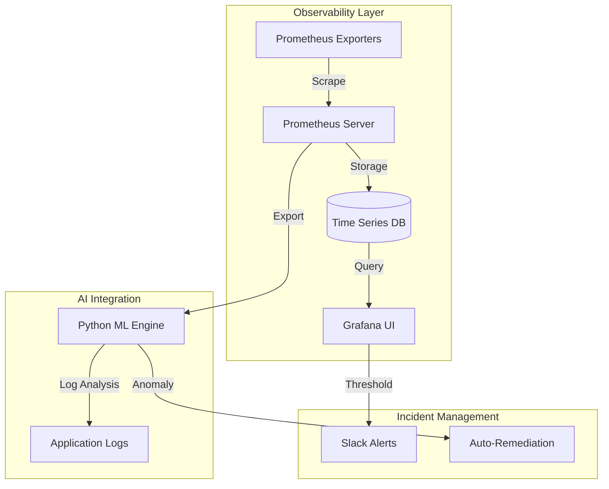

# Monitoring System

A robust observability stack is crucial for enterprise systems. This platform utilizes the industry-standard **Prometheus** and **Grafana** stack.

## Architecture

1. **Metric Collection (Prometheus)**
   - Deployed within the Kubernetes cluster.
   - Uses `kubernetes_sd_configs` for dynamic service discovery.
   - Scrapes metrics from Kubernetes nodes, pods, and the application's `/metrics` endpoint every 15 seconds.

2. **Visualization (Grafana)**
   - Connects to Prometheus as its primary data source.
   - Provides real-time dashboards mapping out system uptime, CPU/Memory consumption, container health, request latency, and application error rates.
   - Features alert thresholds that trigger when metrics exceed standard operational boundaries.

3. **Log Aggregation (ELK simulation)**
   - While a full ELK stack is massive, we simulate centralized logging by tailing application outputs which are then ingested by our custom AI Engine for immediate analysis.

---

